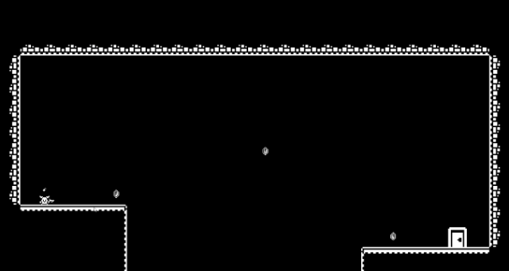

# 👾 Hey there! I’m Gaba 👾
### Game Developer Specializing in Player-Centric Experiences

I’m a game developer with a passion for creating systemic games where player choices drive unique experiences.

# Experience  
- 🎓 Bachelor’s in Computer Science  
- 8 years in game development across mobile and PC  
- 5 years with Unity | 2 years with Godot  
- Collaborated on mobile hits and strategic PC titles

# Highlights

## [Vlogger Go Viral](https://play.google.com/store/apps/details?id=br.com.tapps.vloggergoviral&hl=en)
An idle mobile game where you play as an upcoming YouTuber trying to grow your channel.
Focused on feature development, code optimization, and bug management.

  

## [Skydome](https://store.steampowered.com/app/708550/Skydome/)
An exciting and strategic multiplayer Tower Defense PC game.
Multiplayer game development, character creation, 3D animation, and physics.

  

## [PKXD](https://play.google.com/store/apps/details?id=com.movile.playkids.pkxd&hl=pt)
A multiplayer game with and open-world to live incredible adventures!
Reworked game's IAP store, implemented new events and fixed bugs.

  

## [Cloud Quest](https://aws.amazon.com/training/digital/aws-cloud-quest/)
AWS Cloud Quest is the only 3D role-playing game to help you build practical AWS Cloud skills.
Implemented new learning paths, learning path rewards and the events.

  

## [Recoil](https://store.steampowered.com/app/1949570/Recoil/)
Recoil is a minimalist 2D Platformer where you can only move by shooting.

  

# Latest Projects

## [Tower of Typing](https://store.steampowered.com/app/2976070/Tower_of_Typing/)
Tower of Typing is a roguelite typing game where you must type to cast spells! Wishlist it!

  

## [R.A.K](https://github.com/liberula/rak)
A composable, inspector-driven architecture framework for Godot.
Designed for clean separation, modularity, and scalability — without sacrificing editor integration.

  

---  
E-mail me at [gaba@liberula.com](mailto:gaba@liberula.com) — Let’s make unforgettable game experiences together! 🚀
