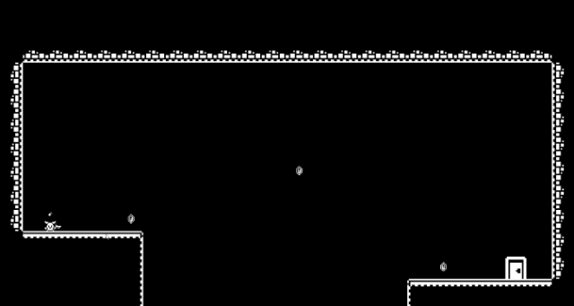

# 👾 Hey, I'm Gaba

### Gameplay Programmer & Systems Designer

I build gameplay-driven experiences focused on systemic interaction, player expression, and memorable moments.

Over the last 9 years I've worked across mobile, multiplayer, PC, and web games, from indie studios to Amazon Web Services (AWS), developing gameplay systems, live features, rapid prototypes, multiplayer experiences, and performance optimizations.

# Experience

- 🎓 Bachelor’s in Computer Science
- 9 years in game development
- Unity | Godot
- Mobile | PC | Multiplayer | Web
- Gameplay Systems
- Rapid Prototyping
- Performance Optimization

# Featured Projects

## [Tower of Typing](https://store.steampowered.com/app/2976070/Tower_of_Typing/)

A roguelite spellcasting game where players type words to cast customizable spells and survive chaotic dungeon runs.

Focused on:
- Gameplay systems
- Combat feel
- Procedural encounters
- Typing-based spellcasting
- Player expression through spell customization

  

---

## [Skydome](https://store.steampowered.com/app/708550/Skydome/)

A multiplayer hybrid between Tower Defense and Action Combat.

Worked on:
- Multiplayer gameplay
- Character systems
- Physics interactions
- 3D animation pipelines

  

---

## [PKXD](https://play.google.com/store/apps/details?id=com.movile.playkids.pkxd&hl=pt)

A large-scale multiplayer social game focused on exploration, customization, and live events.

Worked on:
- In-game store systems
- Event implementation
- Bug fixing and live support

  

---

## [Vlogger Go Viral](https://play.google.com/store/apps/details?id=br.com.tapps.vloggergoviral&hl=en)

An idle/mobile game about growing a content creator empire.

Worked on:
- Feature implementation
- Code optimization
- Mobile performance
- Bug management

  

---

## [Cloud Quest](https://aws.amazon.com/training/digital/aws-cloud-quest/)

AWS Cloud Quest is a 3D role-playing game designed to teach practical AWS Cloud skills through gameplay.

Worked on:
- Learning paths
- Reward systems
- Event systems

  

---

## [Recoil](https://store.steampowered.com/app/1949570/Recoil/)

A minimalist 2D platformer where movement is only possible through weapon recoil.

  

# Prototype Experiments

## Project Roulette Hero

A gameplay prototype focused on high-tension decision making through a customizable roulette-based combat system.

Focused on:
- Gameplay readability
- Emotional tension
- Build customization
- Risk vs reward systems
- Rapid gameplay iteration

  

---

# Links

- LinkedIn: https://www.linkedin.com/in/gabrielfpaula
- itch.io: https://gabahulk.itch.io
- Liberula: https://liberula.com

---

📫 Contact: [gaba@liberula.com](mailto:gaba@liberula.com)
